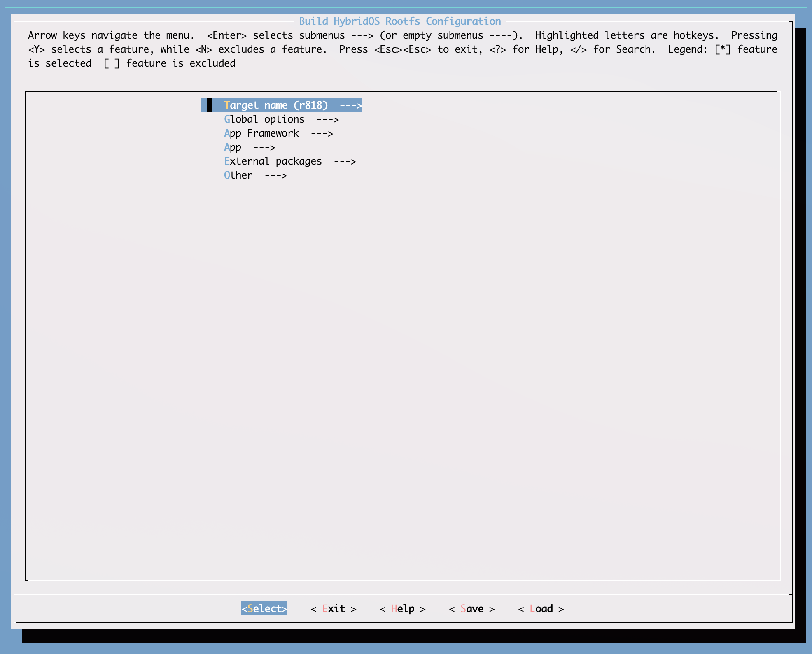
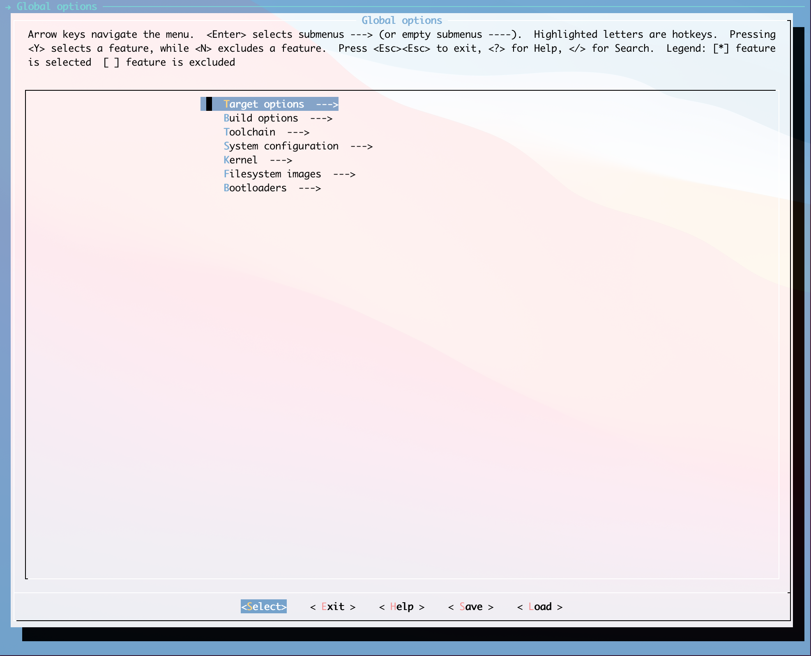
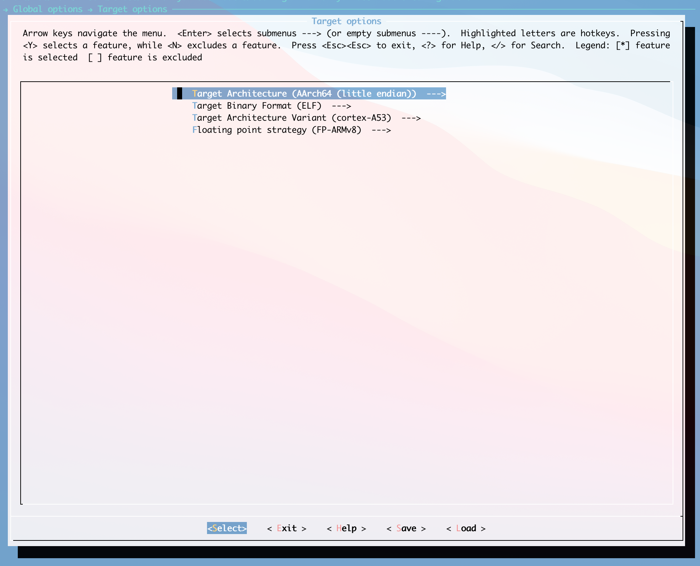
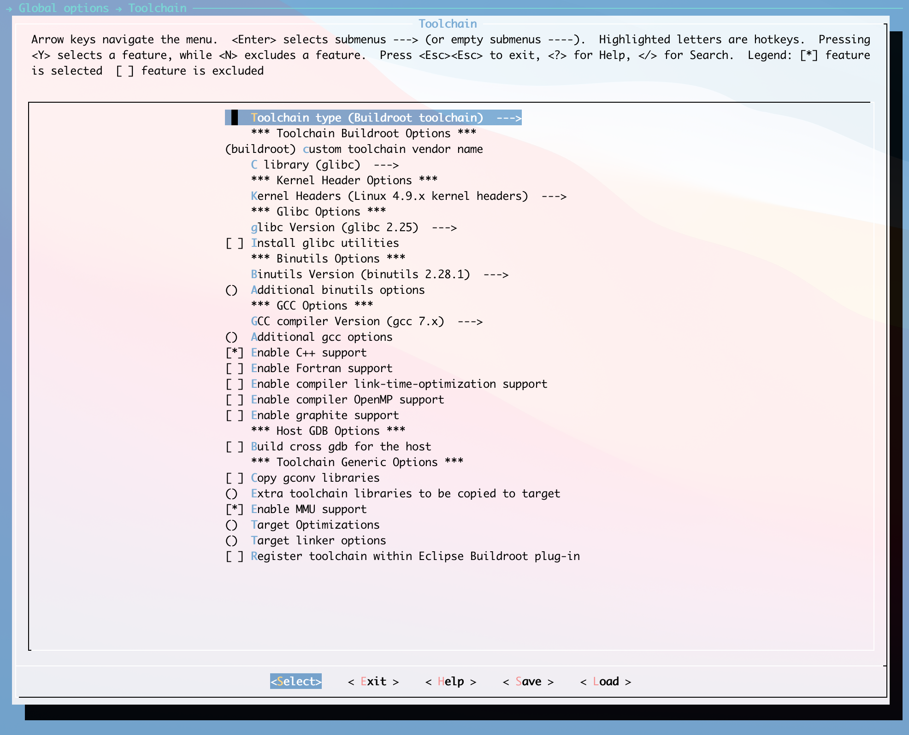
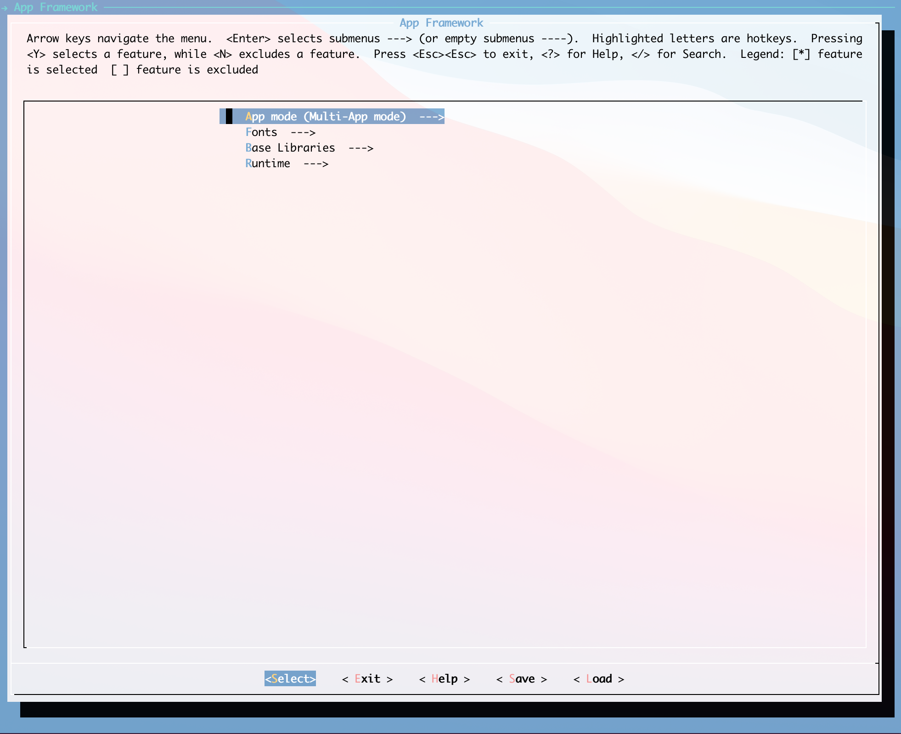
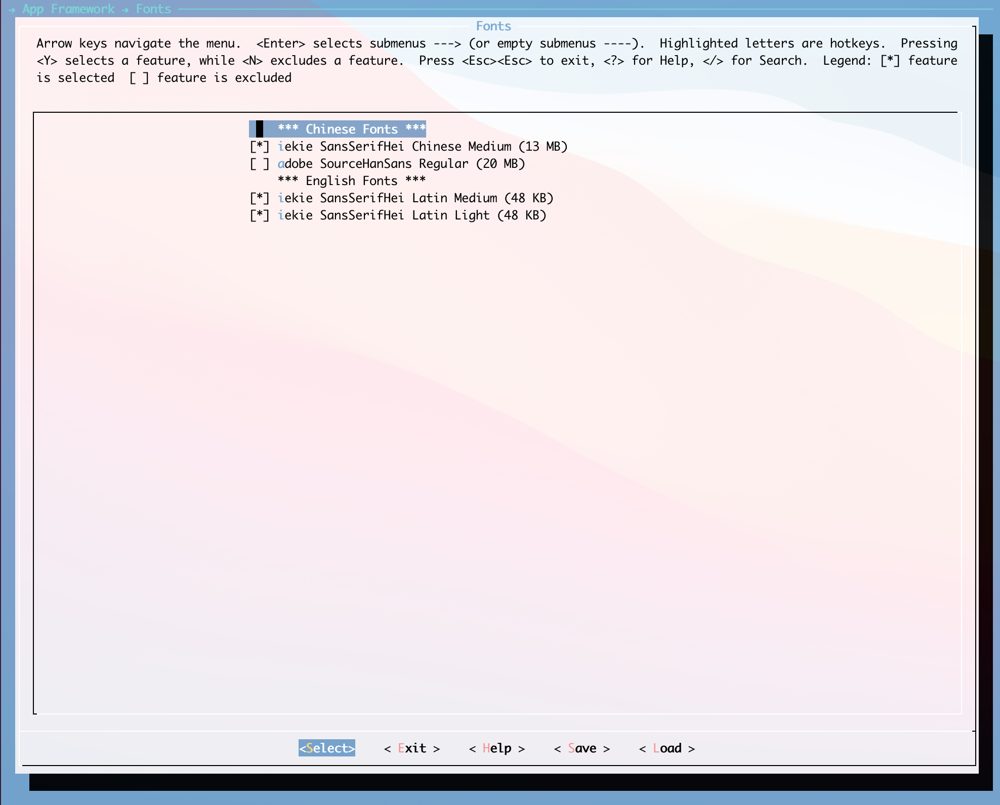
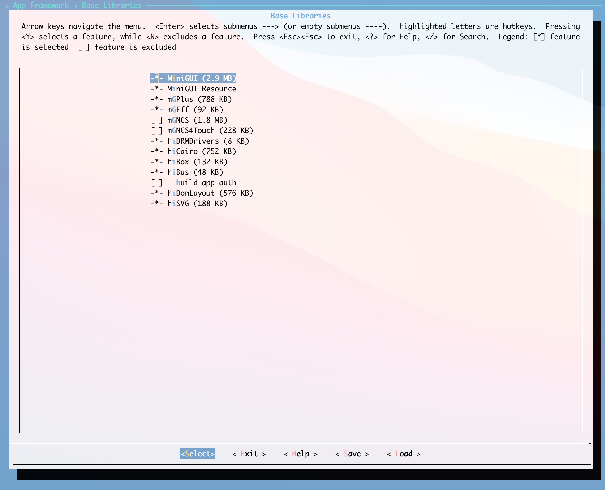
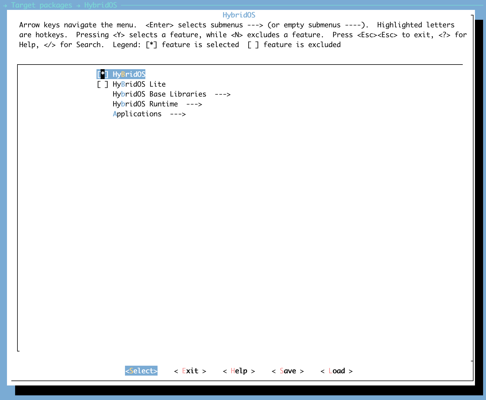
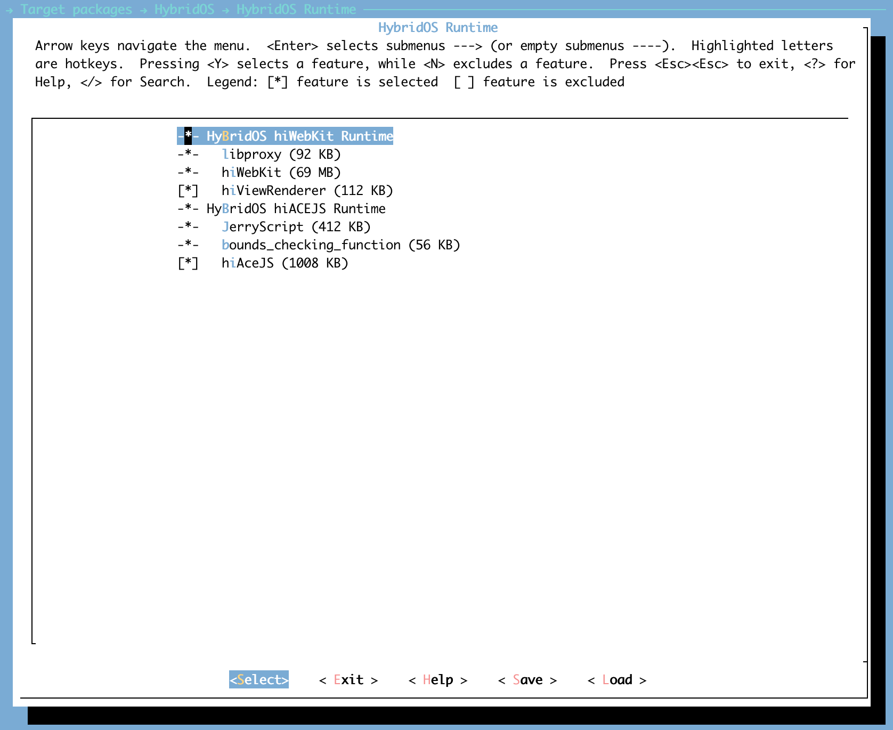
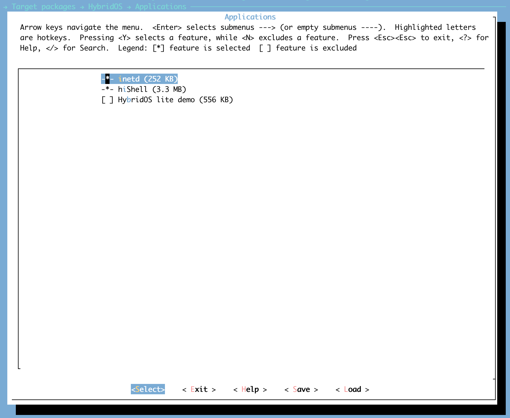

# Building HybridOS rootfs

**目录**

- [概述](#概述)
- [目录结构](#目录结构)
- [构建](#构建)
   + [系统要求](#系统要求)
   + [构建步骤](#构建步骤)
   + [修改构建选项](#修改构建选项)
- [添加软件包](#添加软件包)
   + [应用目录](#应用目录)
   + [配置文件](#配置文件)
   + [.mk 文件](#.mk_文件)
   + [加入编译菜单](#加入编译菜单)
- [发布日志](#发布日志)
   + [r2106](#r2106)
      * [r2106 有如下更新](#r2106-有如下更新)
      * [r818](#r818)
      * [px30](#px30)
- [版权声明](#版权声明)
   + [Special Statement](#special-statement)


## 概述

本仓库包含了用于构建 HybridOS rootfs 的相关脚本，其主要部分是基于 [Buildroot](https://www.buildroot.org/) 实现的。

建议使用最新的 Linux 长期支持版本，例如 Ubuntu Linux LTS 18.04 or 20.04 来进行构建。

## 目录结构

```
build-hybridos-rootfs/
├── arch
├── board
├── boot
├── configs
├── dl
├── docs
├── fs
├── linux
├── output
├── package
├── support
├── system
├── toolchain
└── utils
```

如上图所示，显示了仓库中的主要目录，它们是：

- `arch/` ：存放CPU架构相关的配置脚本，如arm/mips/x86；
- `board/` ：存放了一些开发板的配置补丁之类的；
- `boot/` ：引导系统；
- `configs/` ：针对不同硬件平台的特有配置文件合集；
- `dl/` ： 存放下载的源代码及应用软件的压缩包；
- `docs/` ：存放相关的参考文档；
- `fs/` ：放各种文件系统的构建脚本；
- `linux/` ：存放着Linux kernel的自动构建脚本；
- `output/` ：编译出来的输出文件夹；
- `package/` ：下面放着应用软件的配置文件；
- `support/` ：一些公共基础设施(kconfig code, libtool patches, download helpers, 等等)；
- `system/` ：根文件系统框架；
- `toolchain/` ：工具链相关配置；
- `utils/` ： 主要脚本的存储目录；


`output` 目录是编译输出文件夹，它的结构如下:

```
output
├── build
├── host
├── images
├── staging -> host/aarch64-buildroot-linux-gnu/sysroot
└── target
```

如上图所示，显示了 `output` 目录的内容，它们是:

- `build/` ： 存放解压后的各种软件包，软件包都在该目录下进行编译；
- `host/` ： 是由各类源码编译后在主机上运行的工具的目录，编译出来的主机工具在host/usr下，根目录所需要的库及一些基本目录就在host/xxx/sysroot；
- `images/` ： 最终生成的rootfs就存放在该目录；
- `staging/` ： 软链接到host/xxxx/sysroot/ 就是上面说到的文件系统需要的库及一些基本目录；
- `target/` ： 目录是用来制作rootfs的，里面放着Linux系统基本的目录结构，以及各种编译好的应用库和bin可执行文件

## 构建 

### 系统要求

我们假设您使用的是 Ubuntu Linux 18.04/20.04 LTS。

在 Ubuntu Linux 中，使用 `apt install <package_name>` 命令安装下面的软件包：

* git
* gcc/g++
* binutils
* autoconf/automake
* libtool
* make
* cmake
* pkg-config

```
$ sudo apt install git g++ binutils autoconf automake libtool make cmake pkg-config
```

### 构建步骤

* 设置环境变量

```
$ build/envsetup.sh
```

* 选择目标

```shell
$ lunch

You're building on Linux

Lunch menu... pick a combo:
     1. hybridos
     2. hybridos_lite
     3. px30_hybridos
     4. px30_hybridos_lite
     5. r818_hybridos
     6. r818_hybridos_lite

Which would you like? [Default r818_hybridos]:

```

如上所示，当前内置了六个配置，它们是:

- `hybridos` ：默认编译 HybridOS 的配置
- `hybridos_lite` ：默认编译 HybridOS Lite 的配置
- `r818_hybridos` ：为全志 r818 编译 HybridOS 的配置
- `r818_hybridos_lite` ：为全志 r818 编译 HybridOS Lite 的配置
- `px30_hybridos` ：为全志 px30 编译 HybridOS 的配置
- `px30_hybridos_lite` ：为全志 px30 编译 HybridOS Lite 的配置


* 启动编译，并等待编译完成

直接使用 `make` 命令或者内置命令 `m` 进行编译

```shell
$ make
# 或
$ m
```

*  编译完成后，可以在 output/images 找到 `rootfs.tar`

### 修改构建选项

在选择配置文件之后，启动编译之前，可以通过命令 `make menuconfig` 来修改编译选项，如下:

```
$ make menuconfig
```




下面简单介绍一下主要的菜单，如下:


* `Global options` : 全局的配置选项



* `Global options --> Target options` : 修改目标平台内容，比如CPU类型，浮点数处理等等，如下图所示：



* `Global options --> Toolchain` : 修改工具链相关选项，比如 gcc, glibc 等



* `App Framework` : 应用程序框架



* `App Framework --> App mode` : 应用模型


* `App Framework --> Fonts` :  字体



* `App Framework --> Base Libraries` : 基础软件包菜单




* `App Framework --> Runtime` : 应用程序运行时


* `Target packages` : 修改要编译的软件包


* `Target packages --> HybridOS` : HybridOS 主要相关软件包的菜单




* `Target packages --> HybridOS --> HybridOS Base Libraries` : HybridOS 基础软件包菜单


* `Target packages --> HybridOS --> HybridOS Runtime` : HybridOS Runtime 软件包菜单



* `Target packages --> HybridOS --> Applications` : HybridOS Applications 软件包菜单




## 添加软件包

该部分内容将介绍如何将一个新的软件包加入到 Build HybridOS rootfs 。

### 应用目录

首先，需要在 app/user/ 目录下建立目录，以 `hybridos-lite-demo` 为例，在 app/user/ 下建建名为 `hybridos-lite-demo` 的目录。

### 配置文件

创建配置文件 `Config.in` 以便于将新的应用加入到软件包管理体系。该配置文件使用 Kconfig 语言来描术，可以参考文件[Kconfig Language](https://www.kernel.org/doc/Documentation/kbuild/kconfig-language.txt)。下面以 `hybridos-lite-demo` 为例来说明，其配置文件内容如下:

```
config BR2_PACKAGE_HYBRIDOS_LITE_DEMO
	bool "HybridOS lite samples (556 KB)"
    select BR2_PACKAGE_MINIGUI
    select BR2_PACKAGE_MGPLUS
    select BR2_PACKAGE_MGEFF
    select BR2_PACKAGE_HIDRMDRIVERS
    select BR2_PACKAGE_HICAIRO
    select BR2_PACKAGE_HIBOX
    select BR2_PACKAGE_HIBUS
    select BR2_PACKAGE_HIDOMLAYOUT
    select BR2_PACKAGE_HISVG
	select BR2_PACKAGE_LIBGLIB2
	help
      The sample codes are for HybridOS Lite version,
      mginit and some samples are inclusive.
      It illustrates how to build an entire project, which runs in HybridOS Lite.
	  https://gitlab.fmsoft.cn/hybridos/hybridos-lite
```

* `config XXX` : 定义唯一标识，用于标识一个软件包，一般尽管 `BR2_PACKAGE_` + 软件包名大写 组成，用下划线链接。
* `bool XXX` : 表示这是一个可选包，`XXX` 是提示信息，在 `make menuconfig` 里显示为菜单选项。
* `select XXX` : 表示如果选中当前包，则会自动选中 `XXX` 包
* `help XXX` : 帮助信息，在 `make menuconfig` 时，使用 `?` 可以显示该信息

### .mk 文件

创建以`软件包 + .mk` 命名的文件，该文件使用 Makefile 语法来描述。它主要描述了如何下载、配置、构建、安装软件包。以 `hybridos-lite-demo.mk` 为例:

```
HYBRIDOS_LITE_DEMO_SITE = https://gitlab.fmsoft.cn/hybridos/hybridos-lite
HYBRIDOS_LITE_DEMO_VERSION = 654478f97a699b1fd0a4985f09b1b14018fbd291
HYBRIDOS_LITE_DEMO_SITE_METHOD = git
HYBRIDOS_LITE_DEMO_INSTALL_STAGING = YES
HYBRIDOS_LITE_DEMO_DEPENDENCIES = libglib2 minigui mgeff hicairo hicairo hisvg

$(eval $(cmake-package))
```

* `HYBRIDOS_LITE_DEMO_SITE` : 源码的下载地址。
* `HYBRIDOS_LITE_DEMO_VERSION` : 版本信息，对于 git 来说，这里可以使用 tag name 或者 commit。
* `HYBRIDOS_LITE_DEMO_SITE_METHOD` : 源码获取方式，支持多种方式: wget, scp, svn, cvs, git, hg, bzr, file, local。
* `HYBRIDOS_LITE_DEMO_INSTALL_STAGING`: 是否安装到 staging 目录，如果该软件包会被别的软件包依赖，比如头文件，则该选项需要为 `YES`。
* `HYBRIDOS_LITE_DEMO_DEPENDENCIES` : 配置依赖包，系统保证先编译依赖包。
* `$(eval $(cmake-package))` : 表示该软件包使用 `cmake` 进行编译。支持 autotools, cmake, python, meson 等编译工具。

### 加入编译菜单

编译文件 `app/user/Config.in` 使用 source 命令将新软件包的 Config.in 引入，之后就可以在 `make menuconfig` 菜单中看到该软件包，方法如下:

```
source "app/user/hybridos-lite-demo/Config.in"
```
至此，已经完成将软件包加入到 Build HybridOS rootfs。

## 发布日志

### r2106

HybridOS 开发团队发布 HybridOS r2106。

#### r2106 有如下更新:

* 使用 Build HybridOS rootfs 构建
* Build HybridOS rootfs 增加了 build 目录，用于存放相关构建脚本。
* Build HybridOS rootfs 增加了 lunch 命令，用于列出支持的构建目标菜单，便于选对。
* Build HybridOS rootfs 移除了 Buildroot 中不需要的软件包。
* Build HybridOS rootfs 重新组织了 make menuconfig 主菜单。
* 支持 全志 r818 开发板。
* 支持 瑞芯微 px30 开发板。

#### r818

r818 提供两种方式，第一种方式使用完整刷机包直接刷机即可，刷机包的下载地址如下:

* [HybridOS 固件](https://hybridos.fmsoft.cn/downloads/r2106/r818_hybridos.img)
* [HybridOS 安全固件](https://hybridos.fmsoft.cn/downloads/r2106/r818_hybridos_s.img)
* [HybridOS Lite 固件](https://hybridos.fmsoft.cn/downloads/r2106/r818_lite.img)
* [HybridOS Lite 安全固件](https://hybridos.fmsoft.cn/downloads/r2106/r818_lite_s.img)

第二种方式使用软件包，下载地址如下:

* [HybridOS rootfs](https://hybridos.fmsoft.cn/downloads/r2106/r818_rootfs_hybridos.tar.gz)
* [HybridOS Lite rootfs](https://hybridos.fmsoft.cn/downloads/r2106/r818_rootfs_lite.tar.gz)


以 HybridOS rootfs 为例说明如何运行

* 将设备用usb连接到PC上
* 在PC终端使用adb命令将 HybridOS R818软件包推送到设备上/mnt/UDISK 目录

``` shell
$ adb push r818_rootfs_hybridos.tar.gz /mnt/UDISK/
```

* 在PC终端使用adb命令打开设备的控制台

```shell
$ adb shell
root@TinaLinux:/#
```

* 在设备控制台执行以下命令进行安装和运行

```shell
root@TinaLinux:/# cd /mnt/UDISK
root@TinaLinux:/mnt/UDISK# tar zxvf r818_rootfs_hybridos.tar.gz  # 解压后会看到一个rootfs目录 
root@TinaLinux:/mnt/UDISK# cd rootfs
root@TinaLinux:/mnt/UDISK/sysroot# . ./run.sh  #  运行
```

#### px30

px30 暂时只提供软件包的方式，下载地址如下:

* [HybridOS rootfs](https://hybridos.fmsoft.cn/downloads/r2106/px30_rootfs_hybridos.tar.gz)
* [HybridOS Lite rootfs](https://hybridos.fmsoft.cn/downloads/r2106/px30_rootfs_lite.tar.gz)

以 HybridOS rootfs 为例说明如何安装运行

* 将 px30_rootfs_hybridos.tar.gz 放到主板 /userdata 目录下

``` shell

# tar zcvf px30_rootfs_hybridos.tar.gz
# cd px30_rootfs_hybridos
# . ./setup.sh
# reboot

```

当PX30开发板重新启动后，既可以看见HybridOS界面，并可以通过触摸屏进行操作

## 版权声明

Copyright (C) 2021 Beijing FMSoft Technologies Co., Ltd.

Licensed under the Apache License, Version 2.0 (the "License");
you may not use this file except in compliance with the License.
You may obtain a copy of the License at

   http://www.apache.org/licenses/LICENSE-2.0

Unless required by applicable law or agreed to in writing, software
distributed under the License is distributed on an "AS IS" BASIS,
WITHOUT WARRANTIES OR CONDITIONS OF ANY KIND, either express or implied.
See the License for the specific language governing permissions and
limitations under the License.

### Special Statement

The above open source or free software license does
not apply to any entity in the Exception List published by
Beijing FMSoft Technologies Co., Ltd.

If you are or the entity you represent is listed in the Exception List,
the above open source or free software license does not apply to you
or the entity you represent. Regardless of the purpose, you should not
use the software in any way whatsoever, including but not limited to
downloading, viewing, copying, distributing, compiling, and running.
If you have already downloaded it, you MUST destroy all of its copies.

The Exception List is published by FMSoft and may be updated
from time to time. For more information, please see
<https://www.fmsoft.cn/exception-list>.

Also note that the copyright of the resource assets included in the
demos might be reserved by the copyright owner. For more information,
please see the README files in the sub directories.
